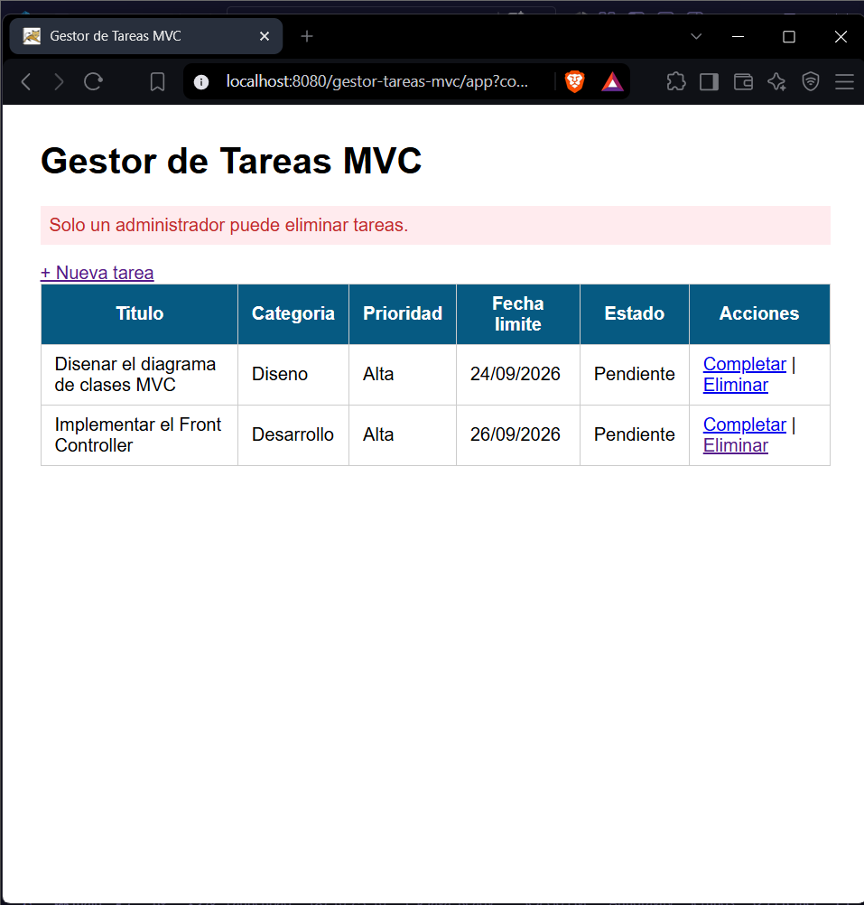
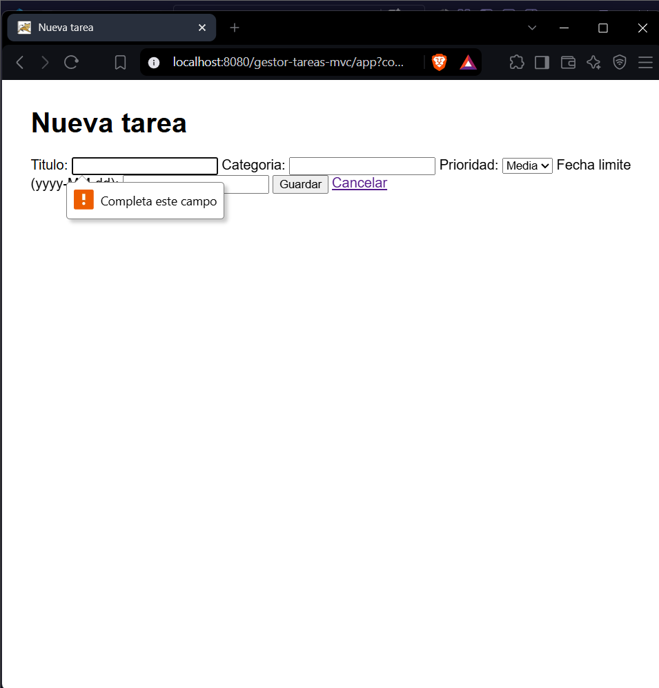
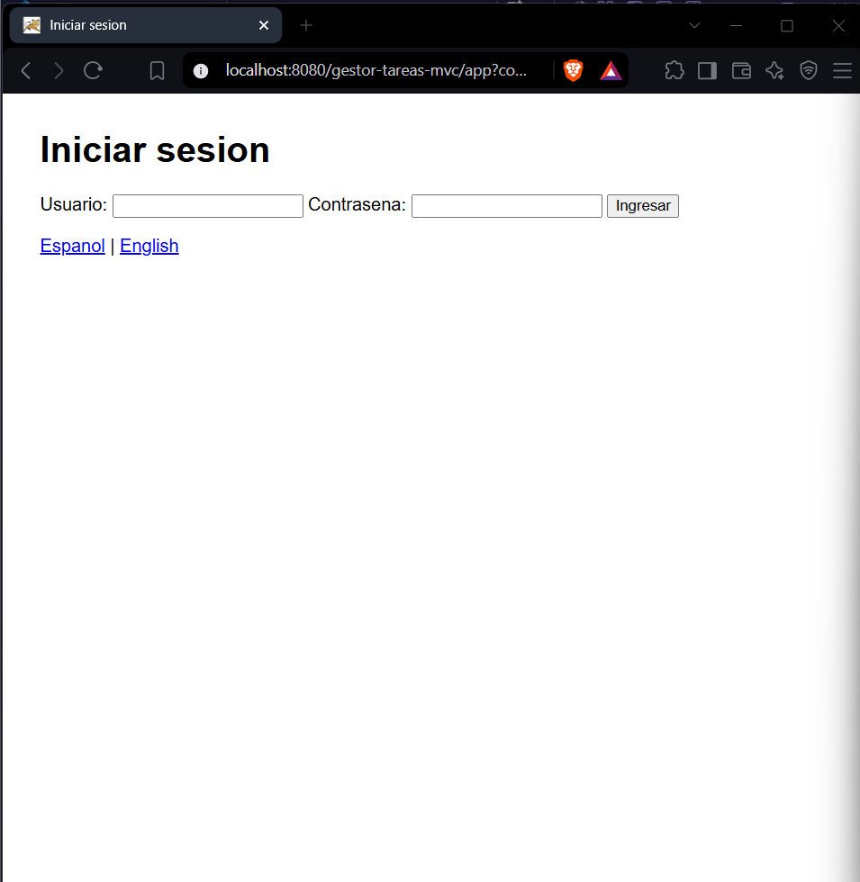
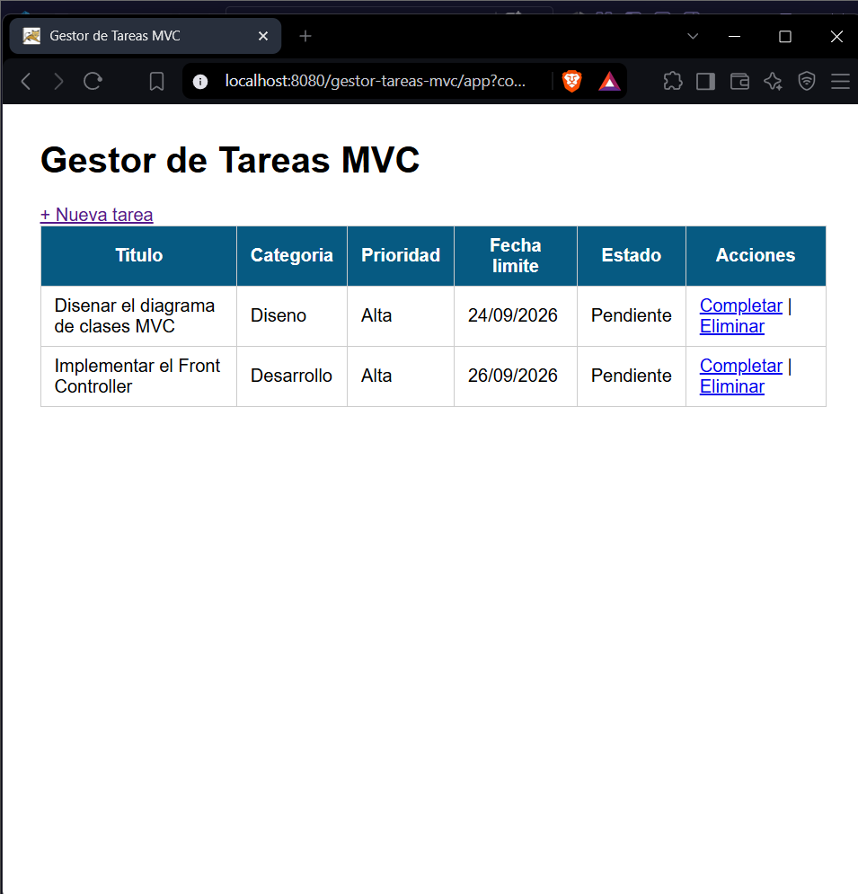
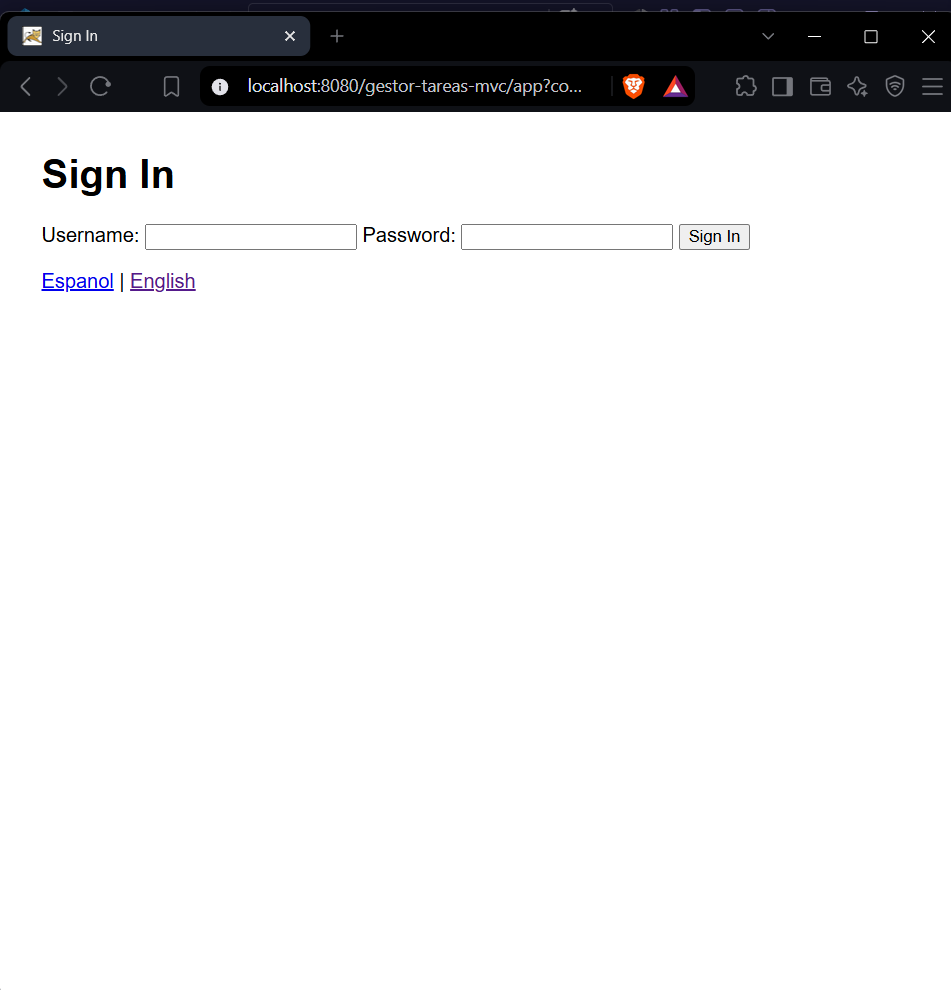

# Post-contenido - Unidad 6: JSP con MVC

## Descripcion
Repositorio del laboratorio de la Unidad 6 de Programacion Web - Septimo
Semestre. Contiene un unico proyecto Maven Web (gestor-tareas-mvc/) que
formaliza el patron MVC con un Front Controller y el patron Comando,
extendido con autenticacion por sesion con roles, validacion por campo
e internacionalizacion.

## Parte 1 - Front Controller y patron Comando
FrontControllerServlet es el unico punto de entrada (/app) y delega en
objetos Comando (ListarComando, FormularioComando, GuardarComando,
EliminarComando, CompletarComando). TareaService y TareaDAO separan la
logica de negocio y el acceso a datos del Controlador. Las vistas usan
JSTL y Expression Language, sin scriptlets.

## Parte 2 - Sesion con roles, validacion por campo e i18n
FrontControllerServlet centraliza la verificacion de sesion antes de
resolver cualquier comando protegido. LoginComando/LogoutComando
gestionan HttpSession con roles ADMIN/USER; EliminarComando solo
permite el rol ADMIN. GuardarComando valida cada campo del formulario
por separado, usando el limite de longitud del titulo leido del
contexto de aplicacion (web.xml). IdiomaComando guarda la preferencia
de idioma en una Cookie, leida directamente en las vistas con el
objeto EL implicito cookie y ResourceBundle (messages.properties /
messages_es.properties).

## Decisiones de diseno
- El Comando devuelve la vista logica (o null si ya hizo un redirect)
  en vez de invocar el forward directamente, para que
  FrontControllerServlet concentre esa llamada en un solo lugar.
- Se uso un Front Controller en vez de un Servlet por accion para que
  la verificacion de sesion de la Parte 2 se agregara una sola vez,
  en procesar(), sin copiarla al inicio de cada Servlet.
- El nombre de usuario y el rol viven en HttpSession porque deben
  expirar con la sesion; el idioma vive en una Cookie porque debe
  sobrevivir al cierre de sesion.
- La longitud maxima del titulo de una tarea se lee del contexto de
  aplicacion (context-param en web.xml) en vez de codificarse como
  literal en GuardarComando, para poder cambiar la regla sin
  recompilar.

## Como compilar y desplegar
1. Clonar el repositorio: git clone [URL-del-repo]
2. Abrir la carpeta como proyecto Maven en VS Code
3. Ejecutar mvn clean package cargo:run
4. Acceder a http://localhost:8080/gestor-tareas-mvc/app

## Capturas de pantalla

